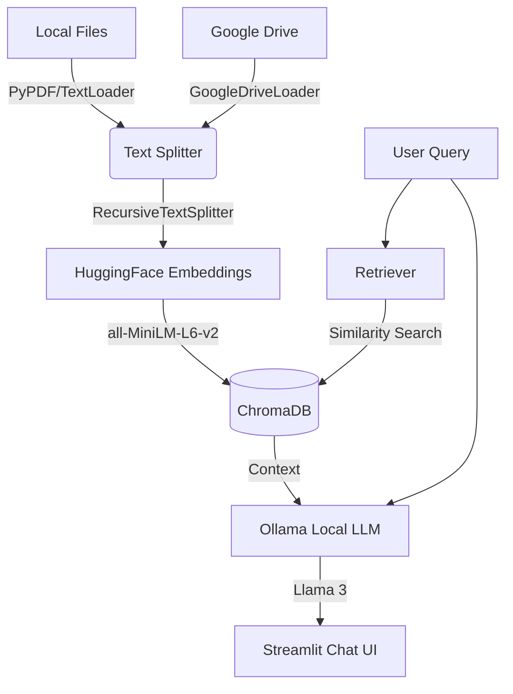

# 📚 PrivateRAG: Local & Cloud Document Intelligence

[](https://www.python.org/downloads/)
[](https://langchain.com/)
[](https://ollama.com/)
[](https://opensource.org/licenses/MIT)

**PrivateRAG** is a fully open-source, generic Retrieval-Augmented Generation (RAG) architecture that allows you to chat with your local documents and Google Drive folders securely. By leveraging local LLMs through Ollama, this system guarantees 100% data privacy—your documents never leave your machine during the inference process.

---

## ✨ Key Features
- **Hybrid Data Ingestion**: Seamlessly ingest `.pdf`, `.txt`, `.md`, and `.csv` files from your local filesystem OR fetch entire directories directly from **Google Drive API**.
- **Privacy First**: Uses [Ollama](https://ollama.com/) to run Large Language Models (like Llama 3) entirely locally.
- **Local Embeddings**: Implements HuggingFace's `all-MiniLM-L6-v2` for blazing-fast, local vector embeddings without expensive API calls.
- **Persistent Vector Store**: Uses [ChromaDB](https://www.trychroma.com/) for efficient, persistent local vector storage.
- **Interactive UI**: Built on [Streamlit](https://streamlit.io/) for a smooth, intuitive chat and document upload experience.

## 🏗️ Architecture



## 🚀 Getting Started

### 1. Prerequisites
- Python 3.10+
- [Ollama](https://ollama.com/) installed on your machine.

### 2. Installation
Clone the repository and install the required dependencies:
```bash
git clone https://github.com/husseinzayat3/PrivateRAG.git
cd PrivateRAG
pip install -r requirements.txt
```

### 3. Setup Local LLM
Ensure Ollama is running in the background with the `llama3` model:
```bash
ollama run llama3
```

### 4. Google Drive Configuration (Optional)
To enable Google Drive integration, you need an **OAuth 2.0 Client ID** configured as a **Desktop app**:

**1. Enable the API**
- Go to the [Google Cloud Console](https://console.cloud.google.com/).
- Create a new project (or select an existing one).
- In the left sidebar, go to **APIs & Services > Library**.
- Search for **Google Drive API** and click **Enable**.

**2. Configure the OAuth Consent Screen**
- Go to **APIs & Services > OAuth consent screen**.
- Choose **External** and click **Create**.
- Fill in the required fields (App Name, Support Email, Developer Contact).
- Under **Scopes**, click **Add or Remove Scopes** and select `.../auth/drive.readonly`.
- Under **Test users**, add your own Google email address.

**3. Create the Credentials**
- Go to **APIs & Services > Credentials**.
- Click **+ Create Credentials** > **OAuth client ID**.
- Under **Application type**, select **Desktop app** and give it a name.
- Click **Download JSON** on the resulting pop-up.
- Rename that downloaded file to `credentials.json` and place it in the root folder of this project (next to `app.py`).

On your first Google Drive ingestion run, a browser window will open asking you to authenticate. Once authenticated, a `token.json` file will be created automatically.

### 5. Run the Application
Launch the Streamlit interface:
```bash
streamlit run app.py
```

## 👨‍💻 About the Author
Built by **Hussein Zayat** - Senior .NET / AI Engineer.
Connect with me on [LinkedIn](#) or check out my other projects on [GitHub](https://github.com/husseinzayat3).

## 📄 License
This project is licensed under the MIT License - see the [LICENSE](LICENSE) file for details.
